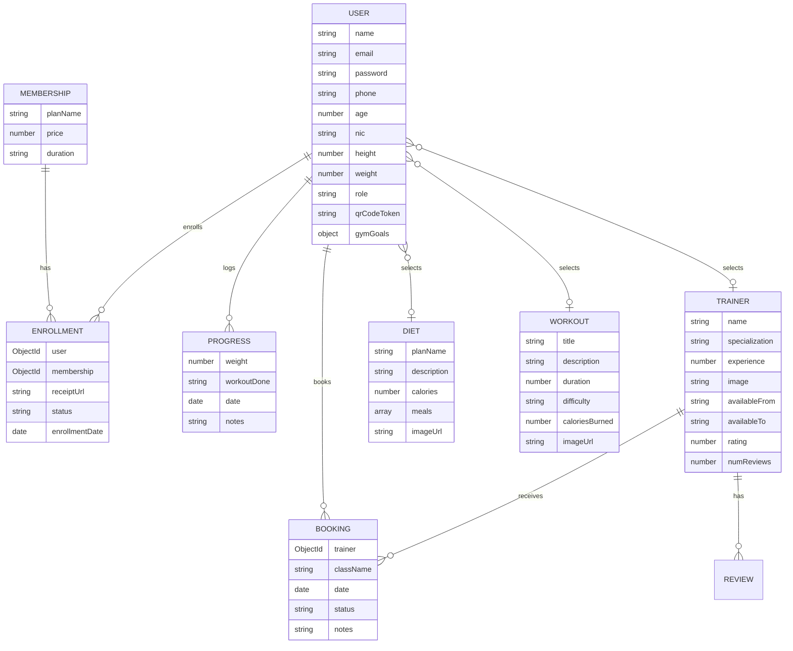

# 🏋️ WMT Gym Management System

**A full-stack mobile application for gym management — built with React Native (Expo) and Node.js**


---

*Manage memberships, track workouts & diets, book trainers, and monitor progress — all from a single mobile app.*

</div>

---

## 📖 Table of Contents

- [Overview](#-overview)
- [Features](#-features)
- [Tech Stack](#-tech-stack)
- [Architecture](#-architecture)
- [Project Structure](#-project-structure)
- [Getting Started](#-getting-started)
- [Environment Variables](#-environment-variables)
- [API Endpoints](#-api-endpoints)
- [Database Models](#-database-models)
- [Testing](#-testing)
- [Screenshots](#-screenshots)
- [License](#-license)

---

## 🔎 Overview

**WMT Gym Management System** is a comprehensive mobile application designed to streamline gym operations for both **administrators** and **members**. The system provides role-based access with distinct dashboards — admins can manage plans, trainers, users, and approve enrollments, while members can enroll in membership plans, select workout & diet routines, book trainers, and track their fitness progress over time.

---

## ✨ Features

### 👤 Member Features
| Feature | Description |
|---|---|
| **🔐 Authentication** | Register / login with JWT-based secure authentication using Expo SecureStore |
| **📋 Membership Plans** | Browse available plans, enroll by uploading a payment receipt (Cloudinary) |
| **🏃 Workout Plans** | Browse and enroll in workout plans (Beginner → Expert difficulty levels) |
| **🥗 Diet Plans** | View and select diet plans with detailed meal breakdowns & calorie info |
| **👨‍🏫 Trainer Booking** | Browse trainers, view ratings & reviews, book sessions, and submit reviews |
| **📈 Progress Tracking** | Log daily weight, completed workouts, and notes; view historical progress |
| **📊 Dashboard** | Overview of active plan, current workout/diet, upcoming bookings, and goals |
| **🔲 QR Code** | Unique QR code per user for gym check-in attendance |
| **⚙️ Profile & Settings** | Update personal info (height, weight, goals), manage account |

### 🛡️ Admin Features
| Feature | Description |
|---|---|
| **📊 Admin Dashboard** | At-a-glance stats for users, enrollments, trainers, and revenue |
| **✅ Pending Approvals** | Review and approve/reject membership enrollment requests with receipt verification |
| **👥 User Management** | View, search, and manage all registered members |
| **📋 Plan Management** | Create, update, and delete membership plans |
| **🏋️ Workout Management** | CRUD operations for workout plans with difficulty levels |
| **🥗 Diet Management** | CRUD operations for diet plans with meal details |
| **👨‍🏫 Trainer Management** | Add, edit, and remove trainers (with image upload to Cloudinary) |
| **📈 Progress Monitoring** | View progress logs submitted by members |
| **📷 QR Scanner** | Scan member QR codes for gym check-in attendance tracking |

### 🌐 Guest Features
- View pricing & membership plans
- Access support/contact information
- Settings and onboarding flow

---

## 🛠️ Tech Stack

### Frontend (Mobile App)
| Technology | Purpose |
|---|---|
| **React Native 0.81** | Cross-platform mobile UI framework |
| **Expo SDK 54** | Managed workflow for rapid development |
| **React Navigation 7** | Native stack & bottom tab navigation |
| **NativeWind / TailwindCSS** | Utility-first styling |
| **Axios** | HTTP client for API communication |
| **Expo SecureStore** | Secure token & credential storage |
| **Expo Image Picker** | Camera & gallery image selection |
| **react-native-qrcode-svg** | QR code generation for attendance |

### Backend (REST API)
| Technology | Purpose |
|---|---|
| **Node.js + Express 5** | Server-side runtime & web framework |
| **MongoDB + Mongoose 9** | NoSQL database & ODM |
| **JWT (jsonwebtoken)** | Stateless authentication tokens |
| **bcryptjs** | Password hashing |
| **Cloudinary + Multer** | Cloud image upload & storage |
| **Jest + Supertest** | Testing framework |

---

## 🏗️ Architecture

```
┌─────────────────────────────────────────────────────────────┐
│                    React Native (Expo)                       │
│  ┌──────────┐  ┌──────────┐  ┌──────────┐  ┌─────────────┐ │
│  │   Auth   │  │   User   │  │  Admin   │  │   Guest     │ │
│  │  Stack   │  │  Tabs    │  │  Tabs    │  │   Tabs      │ │
│  └────┬─────┘  └────┬─────┘  └────┬─────┘  └──────┬──────┘ │
│       └──────────────┴─────────────┴───────────────┘        │
│                         │  Axios + JWT                       │
└─────────────────────────┼───────────────────────────────────┘
                          │  HTTP / REST
┌─────────────────────────┼───────────────────────────────────┐
│                    Express.js API                            │
│  ┌──────────┐  ┌──────────────┐  ┌────────────────────────┐ │
│  │  Routes  │→ │  Controllers │→ │  Mongoose Models       │ │
│  └──────────┘  └──────────────┘  └───────────┬────────────┘ │
│  ┌──────────────────┐  ┌─────────────────┐   │              │
│  │  Auth Middleware  │  │  Cloudinary     │   │              │
│  │  (JWT + Role)     │  │  (Image Upload) │   │              │
│  └──────────────────┘  └─────────────────┘   │              │
└──────────────────────────────────────────────┼──────────────┘
                                               │
                          ┌────────────────────┼──────┐
                          │     MongoDB Atlas          │
                          │  (Users, Plans, Trainers,  │
                          │   Enrollments, Progress…)  │
                          └───────────────────────────┘
```

---

## 📁 Project Structure

```
WMT-Gym-Management-System/
├── backend/
│   ├── config/
│   │   └── cloudinaryConfig.js      # Cloudinary + Multer setup
│   ├── controllers/
│   │   ├── userController.js        # Auth, profile, CRUD
│   │   ├── membershipController.js  # Membership plan CRUD
│   │   ├── enrollmentController.js  # Plan enrollment + receipt upload
│   │   ├── dietController.js        # Diet plan CRUD
│   │   ├── workoutController.js     # Workout plan CRUD
│   │   ├── trainerController.js     # Trainer CRUD + reviews
│   │   ├── progressController.js    # Progress tracking CRUD
│   │   └── bookingController.js     # Trainer booking CRUD
│   ├── middleware/
│   │   └── authMiddleware.js        # JWT protect + admin role guard
│   ├── models/
│   │   ├── userModel.js             # User schema (with gym goals, QR, attendance)
│   │   ├── membershipModel.js       # Membership plan schema
│   │   ├── enrollmentModel.js       # Enrollment schema (with receipt URL)
│   │   ├── dietModel.js             # Diet schema (with meals array)
│   │   ├── workoutModel.js          # Workout schema (difficulty levels)
│   │   ├── trainerModel.js          # Trainer schema (with reviews & ratings)
│   │   ├── progressModel.js         # Progress log schema
│   │   └── bookingModel.js          # Booking schema (with status flow)
│   ├── routes/
│   │   ├── userRoutes.js            # /api/users
│   │   ├── membershipRoutes.js      # /api/memberships
│   │   ├── enrollmentRoutes.js      # /api/enrollments
│   │   ├── dietRoutes.js            # /api/diets
│   │   ├── workoutRoutes.js         # /api/workouts
│   │   ├── trainerRoutes.js         # /api/trainers
│   │   ├── progressRoutes.js        # /api/progress
│   │   └── bookingRoutes.js         # /api/bookings
│   ├── tests/                       # Jest + Supertest test suites
│   ├── utils/
│   │   └── ensureDefaultAdmin.js    # Auto-creates default admin on startup
│   ├── server.js                    # Express app entry point
│   ├── seed_plans.js                # Database seeder script
│   ├── create_admin.js              # Admin creation utility
│   └── package.json
│
├── frontend/
│   ├── src/
│   │   ├── api/
│   │   │   └── axios.js             # Axios instance with base URL & interceptors
│   │   ├── context/
│   │   │   └── AuthContext.js        # Global auth state (login, logout, user)
│   │   ├── navigation/
│   │   │   ├── AuthStack.js          # Login / Register / Onboarding
│   │   │   ├── AppNavigator.js       # Authenticated user stack
│   │   │   ├── AppTabs.js            # User bottom tab navigator
│   │   │   ├── AdminNavigator.js     # Admin bottom tab navigator
│   │   │   └── GuestTabs.js          # Guest bottom tab navigator
│   │   ├── screens/
│   │   │   ├── auth/
│   │   │   │   ├── LoginScreen.js
│   │   │   │   ├── RegisterScreen.js
│   │   │   │   └── OnboardingScreen.js
│   │   │   ├── user/
│   │   │   │   ├── DashboardScreen.js
│   │   │   │   ├── PlansScreen.js       # Membership enrollment + receipt upload
│   │   │   │   ├── WorkoutsScreen.js
│   │   │   │   ├── DietsScreen.js
│   │   │   │   ├── TrainersScreen.js    # Browse, book & review trainers
│   │   │   │   ├── BookingsScreen.js
│   │   │   │   ├── ProgressScreen.js
│   │   │   │   ├── ProfileScreen.js
│   │   │   │   └── SettingsScreen.js
│   │   │   ├── admin/
│   │   │   │   ├── AdminDashboard.js
│   │   │   │   ├── PendingApprovals.js
│   │   │   │   ├── ManagePlansScreen.js
│   │   │   │   ├── ManageUsersScreen.js
│   │   │   │   ├── ManageTrainersScreen.js
│   │   │   │   ├── ManageWorkoutsScreen.js
│   │   │   │   ├── ManageDietsScreen.js
│   │   │   │   ├── ManageProgressScreen.js
│   │   │   │   ├── QRScannerScreen.js
│   │   │   │   └── AdminSettings.js
│   │   │   └── guest/
│   │   │       ├── PricingPage.js
│   │   │       ├── SupportPage.js
│   │   │       └── SettingsScreen.js
│   │   ├── components/
│   │   ├── hooks/
│   │   └── services/
│   ├── App.js                       # Root component with navigation
│   ├── app.json                     # Expo configuration
│   └── package.json
│
├── .gitignore
└── README.md
```

---

## 🚀 Getting Started

### Prerequisites

- **Node.js** v18+ 
- **npm** or **yarn**
- **Expo CLI** — `npm install -g expo-cli`
- **MongoDB Atlas** account (or local MongoDB instance)
- **Cloudinary** account (for image uploads)
- **Expo Go** app on your mobile device (for development)

### 1. Clone the Repository

```bash
git clone https://github.com/<your-username>/WMT-Gym-Management-System.git
cd WMT-Gym-Management-System
```

### 2. Backend Setup

```bash
cd backend
npm install
```

Create a `.env` file in the `backend/` directory:

```env
MONGO_URI=mongodb+srv://<username>:<password>@<cluster>.mongodb.net/<dbname>
JWT_SECRET=your_jwt_secret_key
PORT=5001

CLOUDINARY_CLOUD_NAME=your_cloud_name
CLOUDINARY_API_KEY=your_api_key
CLOUDINARY_API_SECRET=your_api_secret
```

Start the backend server:

```bash
# Development (with hot-reload)
npm run dev

# Production
npm start
```

> The server will start on `http://localhost:5001` by default.

### 3. Seed the Database (Optional)

```bash
# Create a default admin account
node create_admin.js

# Seed membership, diet, and workout plans
node seed_plans.js
```

### 4. Frontend Setup

```bash
cd frontend
npm install
```

Create a `.env` file in the `frontend/` directory:

```env
API_URL=http://<your-local-ip>:5001
```

> ⚠️ Replace `<your-local-ip>` with your machine's local IP address (e.g., `192.168.1.100`). Use `localhost` only for web; physical devices require the actual IP.

Start the Expo development server:

```bash
npx expo start
```

Scan the QR code with **Expo Go** (Android/iOS) to launch the app.

---

## 🔐 Environment Variables

### Backend (`backend/.env`)

| Variable | Description |
|---|---|
| `MONGO_URI` | MongoDB connection string |
| `JWT_SECRET` | Secret key for signing JWT tokens |
| `PORT` | Server port (default: `5001`) |
| `CLOUDINARY_CLOUD_NAME` | Cloudinary cloud name |
| `CLOUDINARY_API_KEY` | Cloudinary API key |
| `CLOUDINARY_API_SECRET` | Cloudinary API secret |

### Frontend (`frontend/.env`)

| Variable | Description |
|---|---|
| `API_URL` | Backend API base URL (e.g., `http://192.168.1.100:5001`) |

---

## 📡 API Endpoints

### Authentication & Users — `/api/users`

| Method | Endpoint | Auth | Description |
|---|---|---|---|
| `POST` | `/register` | ❌ | Register a new user |
| `POST` | `/login` | ❌ | Login and receive JWT token |
| `GET` | `/profile` | 🔒 User | Get current user's profile |
| `PUT` | `/:id` | 🔒 User | Update user by ID |
| `DELETE` | `/:id` | 🔒 User | Delete user by ID |
| `PUT` | `/profile/selections` | 🔒 User | Update diet/workout/trainer selections |
| `GET` | `/` | 🔒 Admin | Get all users |

### Memberships — `/api/memberships`

| Method | Endpoint | Auth | Description |
|---|---|---|---|
| `GET` | `/` | 🔒 User | Get all membership plans |
| `POST` | `/` | 🔒 Admin | Create a new plan |
| `PUT` | `/:id` | 🔒 Admin | Update a plan |
| `DELETE` | `/:id` | 🔒 Admin | Delete a plan |

### Enrollments — `/api/enrollments`

| Method | Endpoint | Auth | Description |
|---|---|---|---|
| `POST` | `/` | 🔒 User | Enroll in a plan (with receipt upload) |
| `GET` | `/` | 🔒 Admin | Get all enrollments |
| `GET` | `/my-enrollments` | 🔒 User | Get current user's enrollments |
| `PUT` | `/:id` | 🔒 Admin | Update enrollment status (Approve/Reject) |
| `DELETE` | `/:id` | 🔒 User | Cancel/delete an enrollment |

### Diets — `/api/diets`

| Method | Endpoint | Auth | Description |
|---|---|---|---|
| `GET` | `/` | 🔒 User | Get all diet plans |
| `POST` | `/` | 🔒 Admin | Create a new diet plan |
| `PUT` | `/:id` | 🔒 Admin | Update a diet plan |
| `DELETE` | `/:id` | 🔒 Admin | Delete a diet plan |

### Workouts — `/api/workouts`

| Method | Endpoint | Auth | Description |
|---|---|---|---|
| `GET` | `/` | 🔒 User | Get all workout plans |
| `POST` | `/` | 🔒 Admin | Create a new workout plan |
| `PUT` | `/:id` | 🔒 Admin | Update a workout plan |
| `DELETE` | `/:id` | 🔒 Admin | Delete a workout plan |

### Trainers — `/api/trainers`

| Method | Endpoint | Auth | Description |
|---|---|---|---|
| `GET` | `/` | 🔒 User | Get all trainers |
| `POST` | `/` | 🔒 Admin | Add a new trainer |
| `PUT` | `/:id` | 🔒 Admin | Update trainer details |
| `DELETE` | `/:id` | 🔒 Admin | Remove a trainer |
| `POST` | `/:id/reviews` | 🔒 User | Submit a review for a trainer |

### Progress — `/api/progress`

| Method | Endpoint | Auth | Description |
|---|---|---|---|
| `GET` | `/` | 🔒 User | Get user's progress logs |
| `POST` | `/` | 🔒 User | Add a new progress entry |
| `DELETE` | `/:id` | 🔒 User | Delete a progress entry |

### Bookings — `/api/bookings`

| Method | Endpoint | Auth | Description |
|---|---|---|---|
| `GET` | `/` | 🔒 User | Get user's bookings |
| `POST` | `/` | 🔒 User | Create a new booking |
| `DELETE` | `/:id` | 🔒 User | Cancel a booking |

---

## 🗄️ Database Models



---

## 🧪 Testing

The backend includes a test suite built with **Jest** and **Supertest**.

```bash
cd backend
npm test
```

### Test Coverage

| Module | Test File |
|---|---|
| User Auth & CRUD | `tests/user.test.js` |
| Enrollment Flow | `tests/enrollment.test.js` |
| Membership Plans | `tests/membership.test.js` |
| Workouts | `tests/workout.test.js` |
| Diets | `tests/diet.test.js` |
| Bookings | `tests/booking.test.js` |

---

## 📸 Screenshots

> *Coming soon — add screenshots of your app here!*

<!-- 
### User Screens
| Dashboard | Plans | Trainers |
|---|---|---|
|  |  |  |

### Admin Screens
| Admin Dashboard | Approvals | Manage Users |
|---|---|---|
|  |  |  |
-->

---

## 🤝 Contributing

1. Fork the repository
2. Create a feature branch (`git checkout -b feature/amazing-feature`)
3. Commit your changes (`git commit -m 'Add amazing feature'`)
4. Push to the branch (`git push origin feature/amazing-feature`)
5. Open a Pull Request

---

## 📄 License

This project is licensed under the **ISC License**.

---

<div align="center">

**Built with ❤️ using React Native & Node.js**

</div>
]]>
